- Nama   : Kaleb Suy
- NIM    : 312110390
- Kelaas : TI.21.B.2
- Tugas  : Pemrograman Web 1

# Lab8Web

## PHP dan Database MySQL

- Buatlah Database pada PHP MyAdmin

- Seperti Berikut

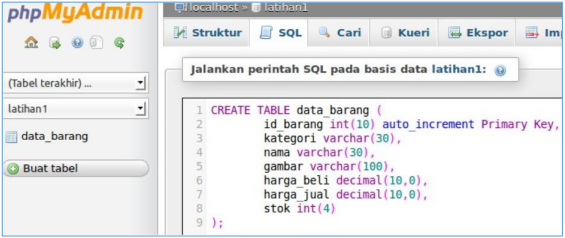

- Lalu tambahkan data seperti berikut :

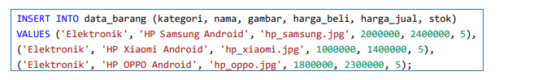

- Inilah tabel database yang kita buat

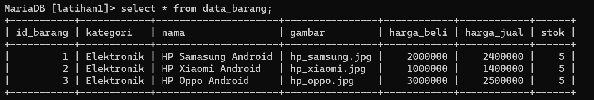

- Setelah itu buat folder dengan nama lab8_php_database, dan ikuti langkah-langkah berikut :

1. Buat File dengan nama "koneksi.php" seperti berikut :

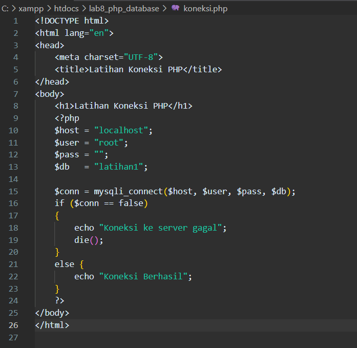

- Seperti ini tampilan pada browser :

2. Lalu untuk menampilkan data, buat file dengan nama "index.php".

- Seperti berikut :

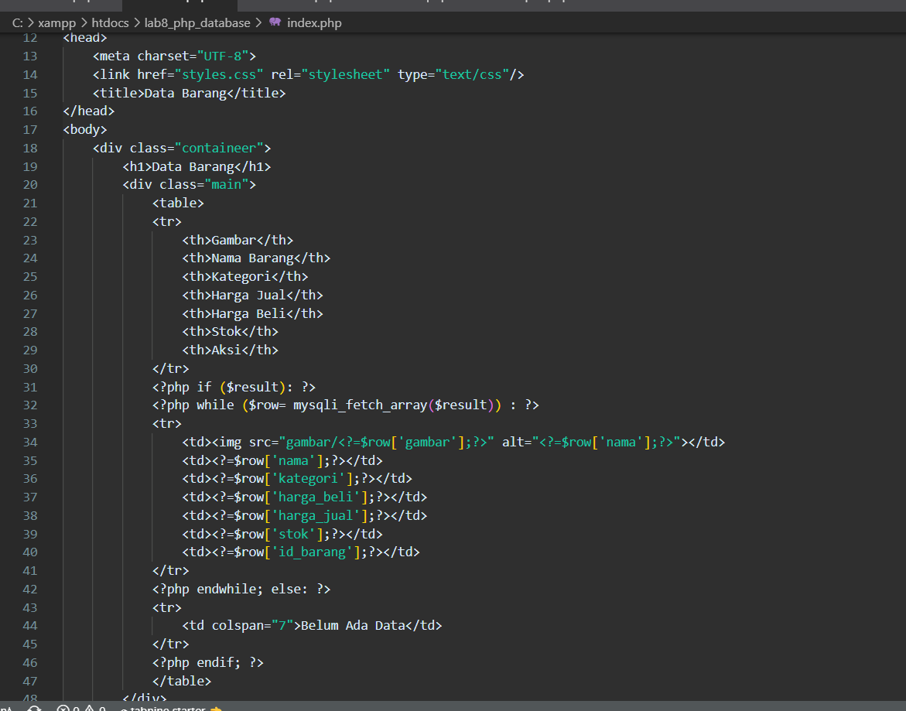

- Akan muncul tampilan pada browser dile databse sudah dibuat. 

- Seperti berikut :

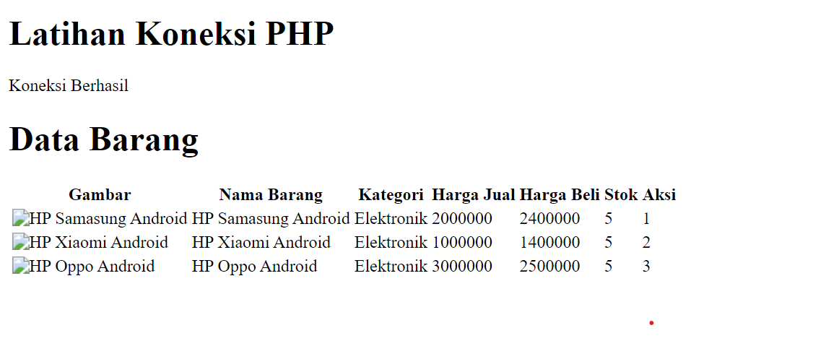

3. Untuk menambahkan data pada databse yang ada, maka buatlah file baru dengan nama "tambah.php"

- Seperti berikut :

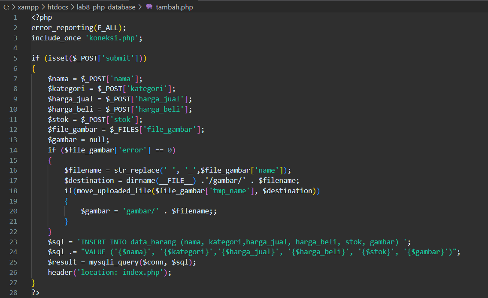

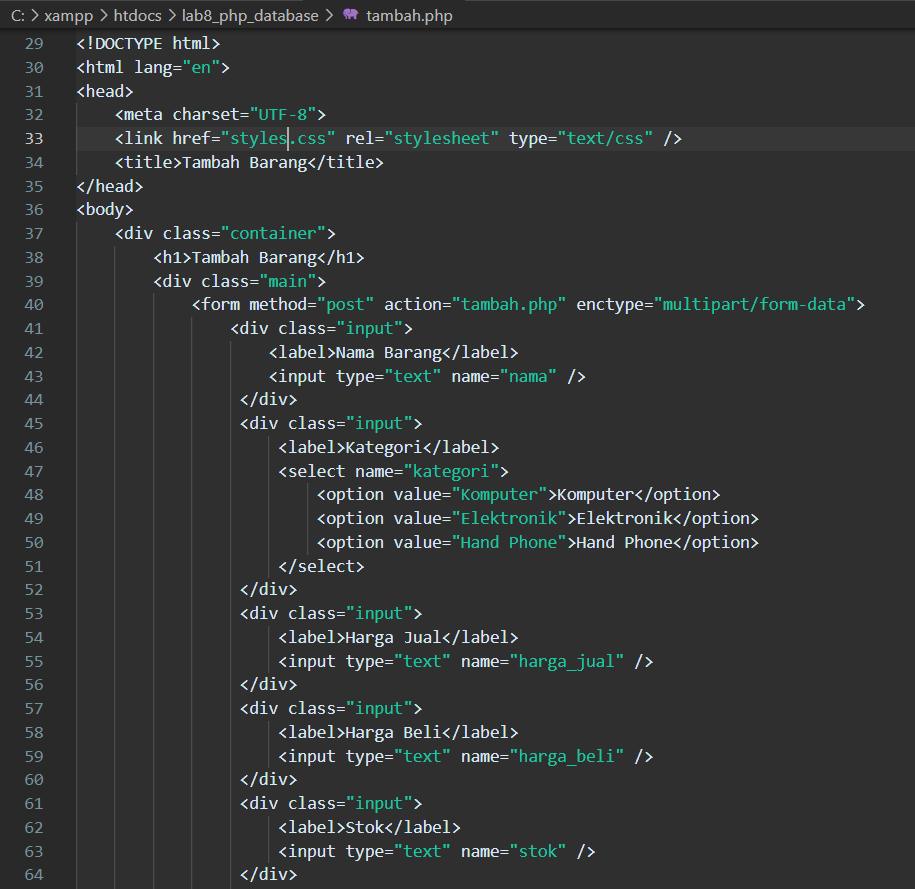

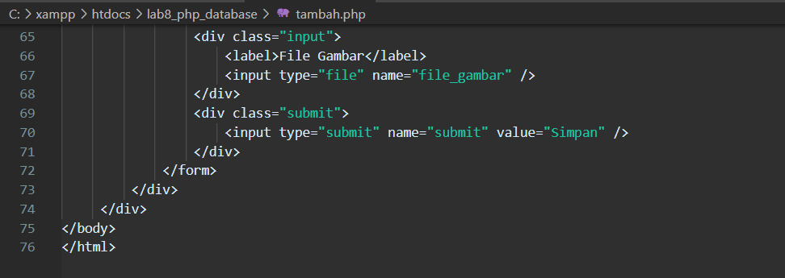

- Seperti ini tampilan awal :

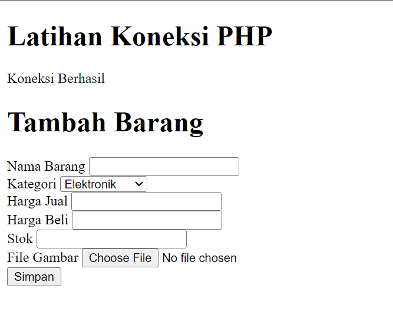

- Seperti ini tampilan setelah kita mengisi form di atas, ada nama barang baru yaitu charger

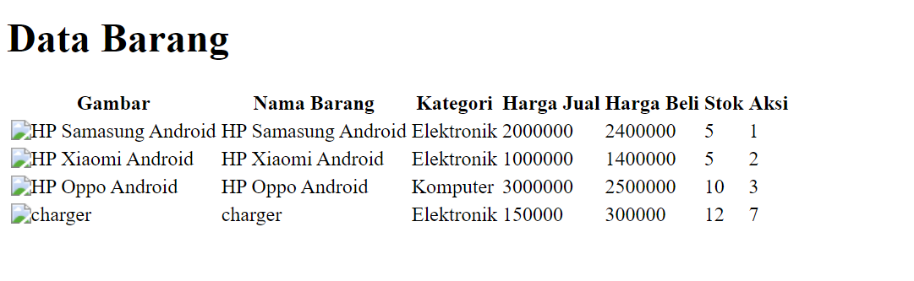

4. Mengubah data.

- Untuk mengubah data buatlah file baru dengan nama "ubah.php"

- Seperti berikut :

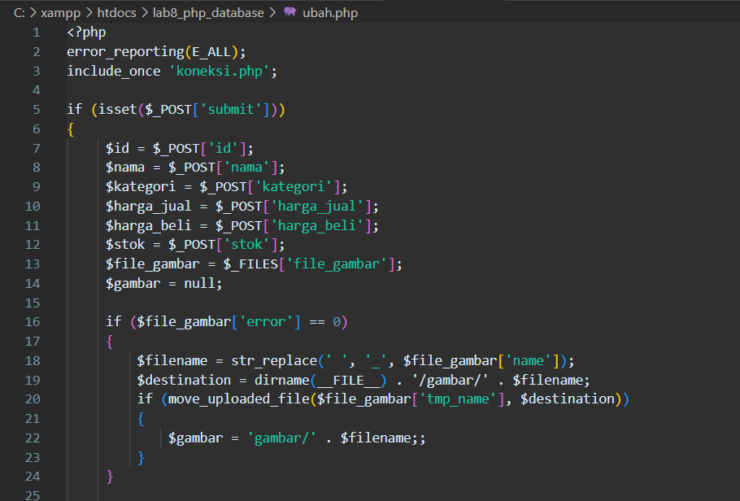

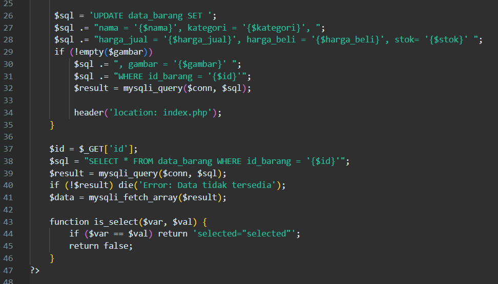

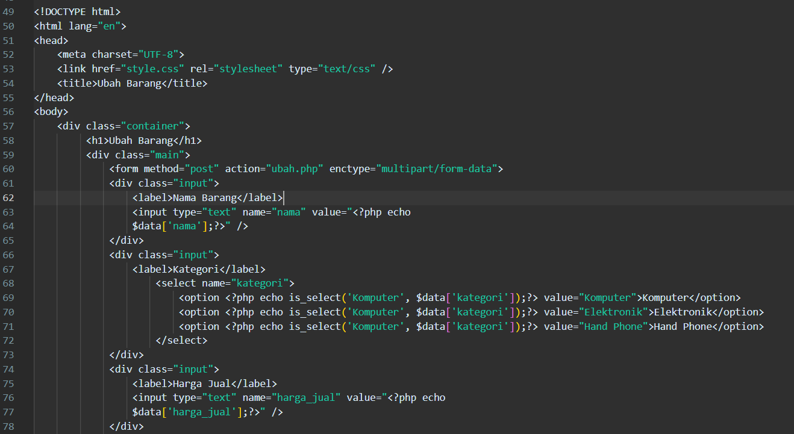

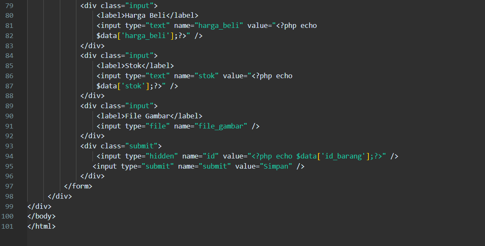

- Seperti ini tampilan form ubah pada browser :

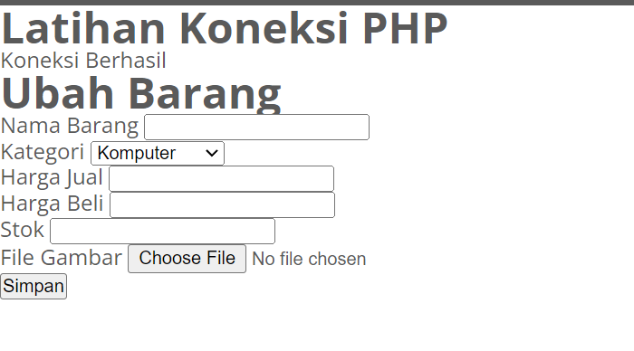

- Pada form ini, barang yang saya ubah adalah HP Oppo dengan stok jadi 15 , serta harganya yang juga diubah

- Seperti ini setelah kita ubah 

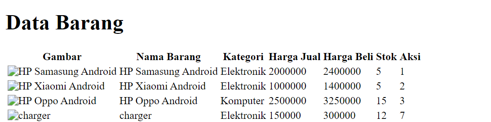

5. Mengahaous data

- Untuk mengahapus data, buatlah file baru  dengan nama "hapus.php"

- Seperti ini :

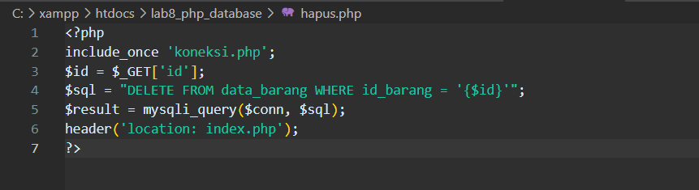

- lalu buka browser dan masukkan id barang yang ingin kita hapus datanya

- Disini saya masuikan id barang "3" jadio yang terhapus adalah data HP Oppo

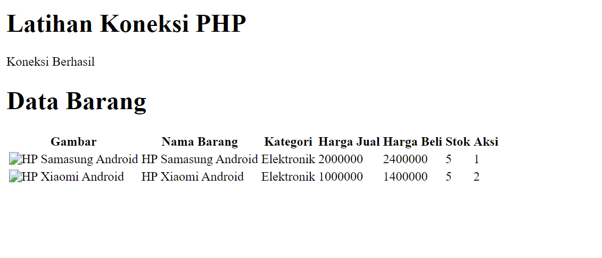

TEKNIK INFORMATIKA

UNIVERSITAS PELITA BANGSA

TAHUN 2022

============= T E R I M A K A S I H =============